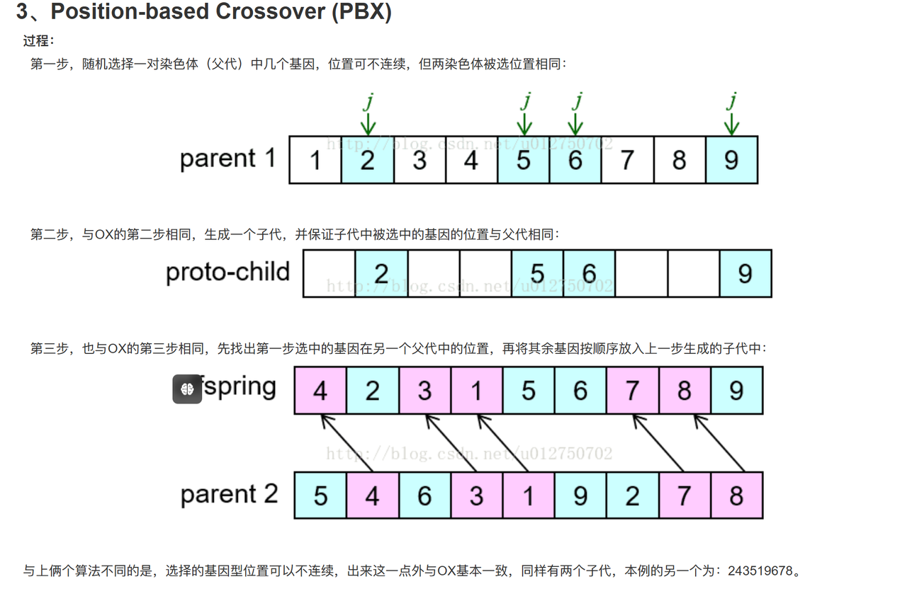
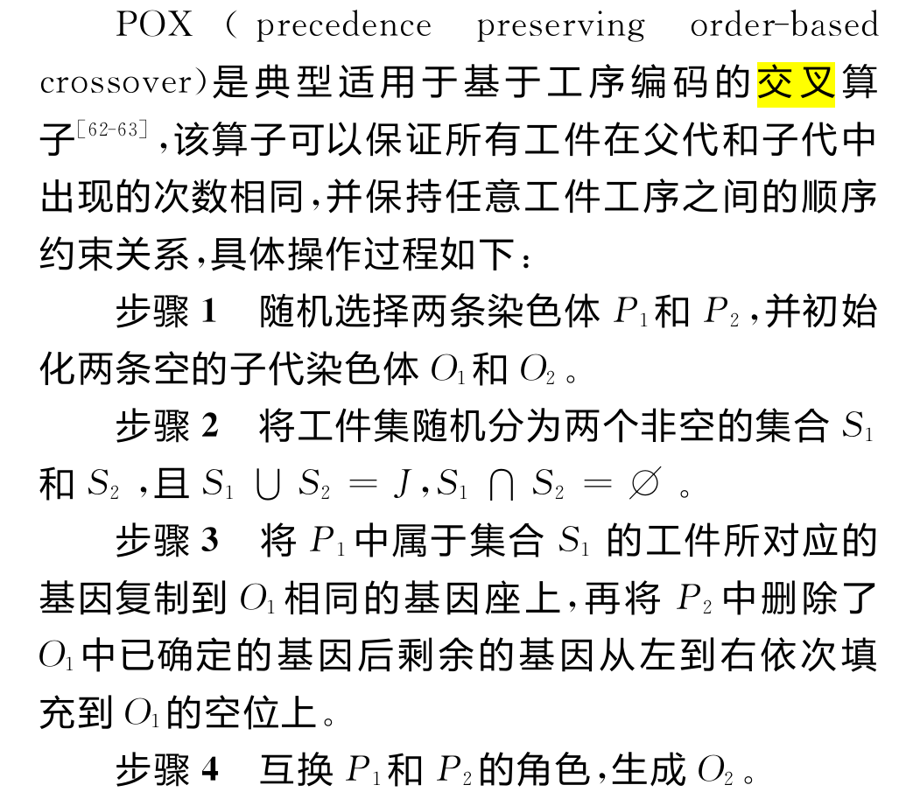
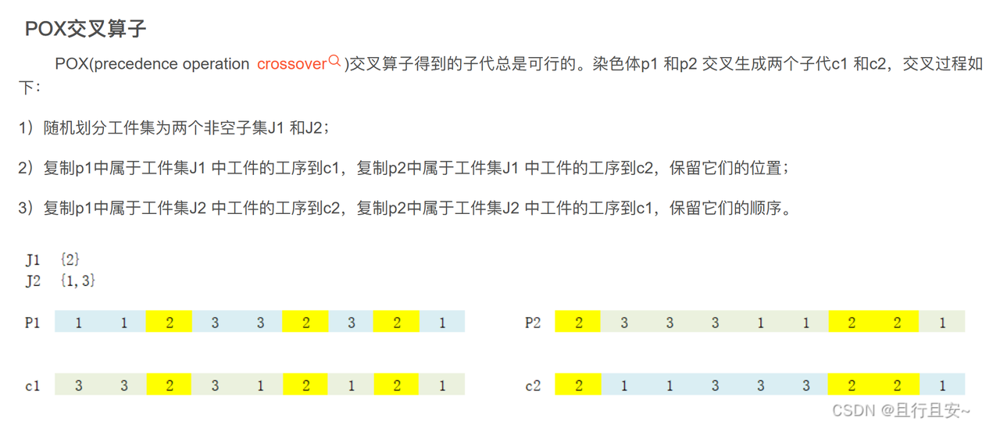
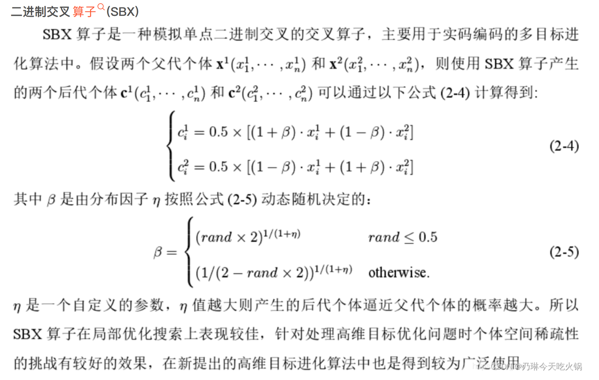
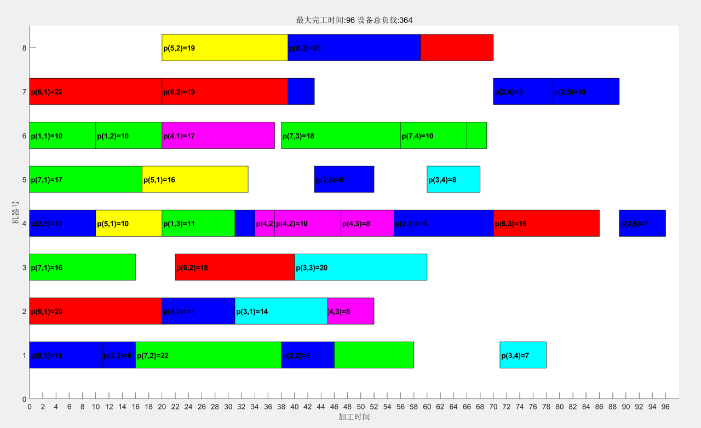

# 使用 NSGA-II 求解柔性作业车间调度问题（FJSP）

说明：本代码来源于网络，经过我的理解和学习后，我添加了大量注释以帮助其他学习者更好地理解代码逻辑。由于本人学识有限，代码中可能存在一些问题未能解决，欢迎各位朋友提出issue或pull request，共同完善和优化代码。


## 问题描述
使用 NSGA-II 求解柔性作业车间调度问题，目标函数考虑：总加工时长最短和机器负荷最小。


## 文件目录

```
NSGA2_FJSP
	- cal_comp_time.m  目标函数
	- cal_def_time.m  目标函数
	- cal_ene_consu.m  目标函数
	- cal_equ_load.m  目标函数
	- data_mac.m  机器信息
	- data_pro.m  工件、工序、工时信息
	- decode.m  机器、工序编码
	- entropy_weight_method.m  熵值法
	- ganttChart1.m  绘制甘特图
	- genetic_operator.m  
	- initPop.m  初始化
	- machine index.m  
	- non_domination_sort.m  快速非支配排序
	- nsga2_scheduling.m  运行主函数
	- tournament_selection.m  锦标赛选择
```


## 代码运行

运行 `nsga2_scheduling.m` 文件即可


## 问题记录

### 关于测试数据的问题-data_pro.m、data_mac.m

如果增加工件及其工序、所用设备、加工时间，或者说，就是基于data_pro.m的数据，新增J(9)、J(10)……这该如何添加呢？另外，机器设备信息如何添加？


### 关于 genetic_operator.m 的问题

#### 代码缩进

关于 `genetic_operator.m` 文件，需要检查缩进是否正确，具体位置在 `for i = 1 : N` 这个循环里。
```matlab
 for i = 1 : N 
        if rand(1) < across
            parent_1 =randperm(N,1); 
            parent_2 =randperm(N,1);
            while isequal(p_parent_chromosome(parent_1,:),p_parent_chromosome(parent_2,:))
                parent_2 = randperm(N,1);
            end
```

#### 交叉变异的子代数量

`for i =1:N`，为什么最终子代个体数有 2N 个？这里 N=100，我运行代码得到 170 个左右（p_child_matrix变量有 170 行）

可能原因：变异率 across=0.8，那就是 100\*(2\*0.8+1\*0.1)=170


```matlab
function[p_child_matrix, m_child_matrix] = genetic_operator(J, p_parent_chromosome, m_parent_chromosome)
    [N, M] = size(p_parent_chromosome);  % N是交配池中的个体数量
    V=4;  % 优化目标数量
    across=08;
    mutation=0.1;  % 变异率
    p_child_matrix=[];
    m_child_matrix=[];
    k=1;  % k记录生成的子代种群的数量，达到pop_size时，跳出循环
    for i = 1 : N  % 这里虽然循环N次，但是每次循环都会有概率产生2个或者1个子代，所以最终产生的子代个体数量大约是2N个
        if rand(1) < across  % 交叉概率0.8
            parent_1 =randperm(N,1);  % 生成一个从1-N的整数
            parent_2 =randperm(N,1);
```


#### 交叉操作

我发现代码中通过 if else 设置了两种交叉操作，也就是：若 i 不能被2整除，则对**工序和机器都**进行交叉操作；若 i 能被整除，则**仅对机器**做交叉操作。为什么要增加 if else 来实现交叉操作？这里采用的交叉方法是什么？


代码最开始写的是：交叉为模拟二进制交叉SBX，但是SBX涉及复杂计算，应该不是。

if 为 true 部分的交叉操作为：根据随机产生的 0、1 向量，得到若干工件的工序编码，因为任一工件的工序数确定，而且群落中每个个体的工件工序都相同，所以由父一代选出子一代，并将父二代编码添加进子一代。机器编码交叉部分同步操作。**因为涉及工件集，有点类似于下面的POX。**

If 为 false 部分的交叉操作为：随机从28个编码中选取若干位置，每个位置在工序编码中对应一个工件的工序，再随机确定工件的某道工序，将第二个父代的某工件某工序的机器编码放到第一个子代中。**不知道是什么交叉方法。**

比较相关的论文「求解多目标双资源柔性车间调度问题的改进NSGA-Ⅱ算法_张守京」，采取的方法是"采用 PBX 和 LOX 交叉算子相结合的方式优化的效果优于单一交叉算子，并在交叉过程中各按 50% 的概率进行随机选择。该方法引用自论文「考虑可再生能源的多目标柔性流水车间调度问题_吴秀丽」，其中并没有详述 PBX 和 LOX 交叉。

关于 PBX，博客[遗传算法中几种交叉算子小结-CSDN博客](https://blog.csdn.net/u012750702/article/details/54563515)有提及




关于 POX，论文 求解柔性作业车间调度的遗传算法综述_黄学文、博客[基于POX、JBX交叉的遗传算法求解车间调度_pox交叉-CSDN博客](https://blog.csdn.net/qq_20412595/article/details/131942455)有提及

|    |    |
|----|----|
|   |  |


关于 SBX[模拟二进制交叉算子(SBX)与多项式变异(PM)-CSDN博客](https://blog.csdn.net/Ryze666/article/details/123826212)有提及




交叉部分的代码见下，或genetic_operator.m文件的第23行附近

```matlab
        if mod(i,2)==1%进行工序交叉
            J1=[];
            c1_p=zeros(1,M-V-2);%子代染色体
            c1_m=zeros(1,M-V-2);
            c2_p=zeros(1,M-V-2);
            c2_m=zeros(1,M-V-2);
            while size(J1,1)==0&&size(J1,2)==0
                J1=find(round(rand(1,size(J,2)))==1);
            end
            for j=1:size(p_parent_1,2)%将属于第一个父代染色体中属于J1的工序位置保留下来，同理将第二个父代染色体中不属于J1的工序位置保留下来
                if ismember(p_parent_1(j),J1)
                    c1_p(j)=p_parent_1(j);
                    c1_m(j)=m_parent_1(j);
                end
                if ~ismember(p_parent_2(j),J1)
                    c2_p(j)=p_parent_2(j);
                    c2_m(j)=m_parent_2(j);
                end
            end
            index_1_1=find(c1_p==0);
            index_1_2=find(c2_p~=0);
            index_2_2=find(c2_p==0);
            index_2_1=find(c1_p~=0);
            for j=1:size(index_1_1,2)
                c1_p(index_1_1(j))=p_parent_2(index_1_2(j));
                c1_m(index_1_1(j))=m_parent_2(index_1_2(j));
            end
            for j=1:size(index_2_2,2)
                c2_p(index_2_2(j))=p_parent_1(index_2_1(j));
                c2_m(index_2_2(j))=m_parent_1(index_2_1(j));
            end
        else%进行设备交叉
            c1_p=p_parent_1;
            c1_m=m_parent_1;
            c2_p=p_parent_2;
            c2_m=m_parent_2;
            m_cross_index=find(round(rand(1,M-V-2))==0);%确定需要进行设备交叉的工序
            for j=1:size(m_cross_index,2)
                p_var=p_parent_1(m_cross_index(j));
                p_var_index=find(p_parent_1==p_var);
                p_number=find(p_var_index==m_cross_index(j));%确定出该交叉点为哪个工件的第几道工序
                %确定出该工件的该道工序在第二个父代中的位置
                c2_across_index=find(p_parent_2==p_var);
                c1_m(m_cross_index(j))=m_parent_2(c2_across_index(p_number));
                c2_m(c2_across_index(p_number))=m_parent_1(m_cross_index(j));
            end      
        end
```


#### 变异操作

1、工序变异的代码不提供吗？有实现思路吗？

2、代码中基于设备/机器的变异，大意是对子代c4_m，在rand_num_3、rand_num_4两个位置上做变异操作吗？


代码见下，或genetic_operator.m文件的第78行附近

```matlab
%基于工序和设备变异
        if rand(1)<mutation%变异概率
            parent_3 = randperm(N,1);
            parent_4 = randperm(N,1);
            p_parent_3 = p_parent_chromosome(parent_3,1:M-V-2);%参与工序变异的染色体
            m_parent_3 = m_parent_chromosome(parent_3,:);
            p_parent_4 = p_parent_chromosome(parent_4,1:M-V-2);%参与机器变异的染色体
            m_parent_4 = m_parent_chromosome(parent_4,:);
            c3_p=p_parent_3;
            c3_m=m_parent_3;
            c4_p=p_parent_4;
            c4_m=m_parent_4;
            rand_num_1=randperm(M-V-2,1);%基于工序变异的，参与变异的第一个位置
            rand_num_2=randperm(M-V-2,1);%基于工序变异的，参与变异的第二个位置
            while isequal(rand_num_1,rand_num_2)
                rand_num_2=randperm(M-V-2,1);
            end
%基于工序变异方法有误，请自行编写
%             c3_p(rand_num_1)=p_parent_3(rand_num_2);
%             c3_m(rand_num_1)=m_parent_3(rand_num_2);
%             c3_p(rand_num_2)=p_parent_3(rand_num_1);
%             c3_m(rand_num_2)=m_parent_3(rand_num_1);
%             p_child_matrix(k,:)=c3_p;
%             m_child_matrix(k,:)=c3_m;
%             k=k+1;
% 基于设备的变异
            rand_num_3=randperm(M-V-2,1);%参与变异的第一个位置
            rand_num_4=randperm(M-V-2,1);%参与变异的第二个位置
            while isequal(rand_num_3,rand_num_4)
                 rand_num_4=randperm(M-V-2,1);
            end
            p_var_3=p_parent_4(rand_num_3);
            p_var_4=p_parent_4(rand_num_4);
            muta_index_1=find(p_parent_4==p_var_3);
            num_of_p_1=find(muta_index_1==rand_num_3);%工件p_var的第num_of_1道工序
            muta_index_2=find(p_parent_4==p_var_4);
            num_of_p_2=find(muta_index_2==rand_num_4);
            m1=randperm(size(J(p_var_3).m{num_of_p_1},2),1);
            m2=randperm(size(J(p_var_4).m{num_of_p_2},2),1);
            c4_m(rand_num_3)=J(p_var_3).m{num_of_p_1}(m1);
            c4_m(rand_num_4)=J(p_var_4).m{num_of_p_2}(m2);
            p_child_matrix(k,:)=c4_p;
            m_child_matrix(k,:)=c4_m;
            k=k+1;
        end
```


### 关于 nsga2_scheduling.m 的问题
#### 种群个数

虽然有设种群数量变量 pop=200，但是**种群个体数不是固定不变的**。

具体来说，初始种群个体数为 100（可见 nsga2_scheduling.m 的代码 for i=1:pop_f，其中 pop_f=100）

迭代操作中：

> 由锦标赛选择出的 100 个个体，经过交叉、变异后得到的子代（p_child_matrix）数量达到200+，而且具体数量受随机数影响而不确定
>
> 父子代种群合并部分，将父代的 10 个个体添加到子代中，总个体数又+10

#### 连续多次运行代码色块重叠
问题定位：decode.m 中关于插入工序的操作


